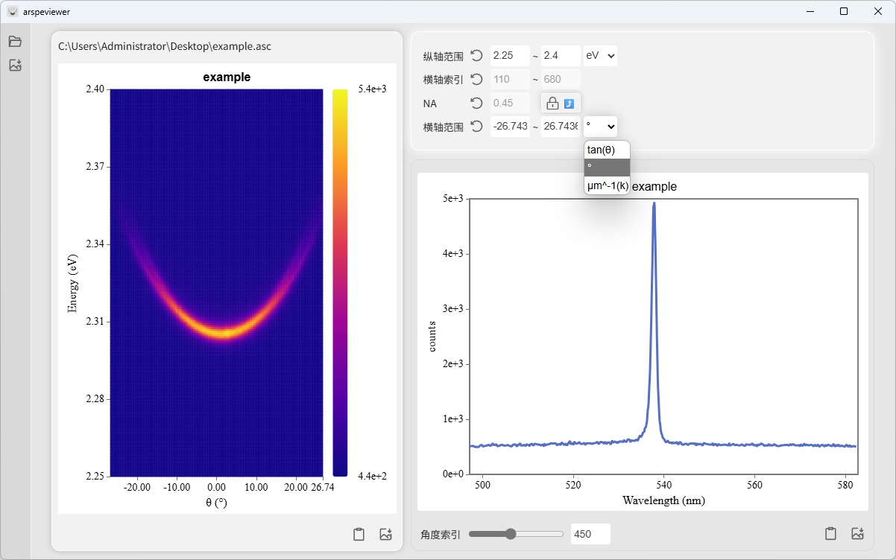

<h1 align="center">
  
  <br>
  <!-- <a href="https://github.com/prcxhy/ARSpeViewer">ARSpeViewer</a> -->
  ARSpeViewer
  <br>
</h1>
<h3 align="center">
(Angle-Resolved Spectral Viewer)<br>基于<a href="https://github.com/tauri-apps/tauri">Tauri</a>开发的角分辨光谱浏览器
</h3>

## 预览


## 功能
- 角分辨光谱数据文件(*.spe, *.asc, *.txt, *.csv)的读取
- 角分辨光谱heatmap基础绘图、剪裁和导出
- 角度切片光谱基础绘图和导出

## 安装
支持 Windows 和 Mac OS，请到发布页面下载对应的安装包：[Release page](https://github.com/prcxhy/ARSpeViewer/releases)<br>

## Mac OS 使用注意
由于开发者没钱注册Apple开发者账号，无法给此应用合法签名，在Mac OS上直接安装启动会提示文件损坏，采取以下步骤方可正常使用

1. 拖动安装文件夹(默认是**Applications**)至**终端**打开
2. 输入并回车执行以下命令:
   
   ```shell
   xattr -cr arspeviewer.app
   ```
3. 即可正常启动ARSpeViewer

## License
GPL-3.0 License. See [License here](./LICENSE) for details.